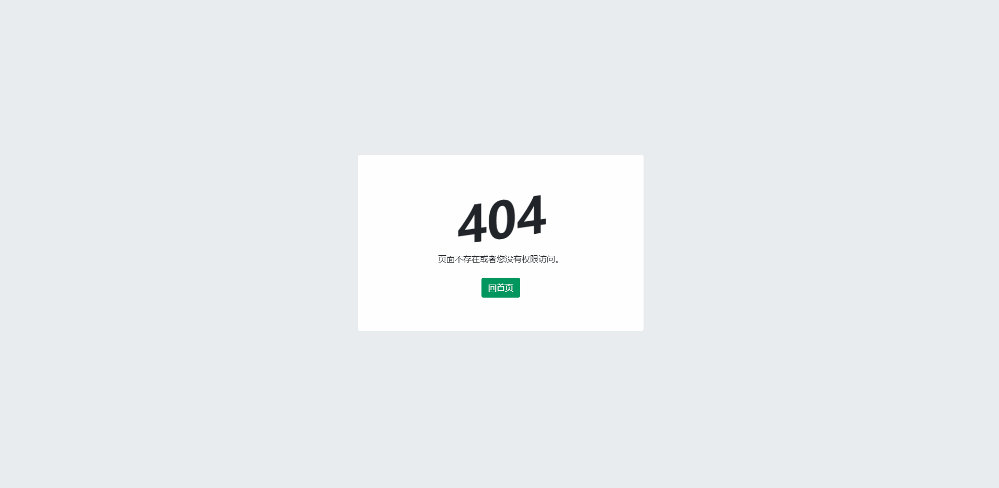

<!-- <!DOCTYPE html>
<html>

<head>
  <title data-react-helmet="true">HTTP 404 - SegmentFault</title>
  <meta charset="utf-8">
  <link rel="stylesheet" href="./style/main.css">
</head>

<body>
  

    

      

        

          

            <h1 data-t="404" class="h1">404</h1>
          

          
还没有内容，稍后回来看看吧！

          
<a href="http://kezio.com.cn/" role="button" tabindex="0" class="btn btn-primary">回首页</a>

        

      

    

  

</body>

</html> -->

# 404
