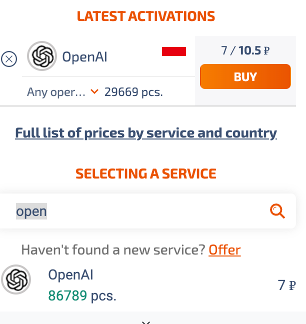

# 前言
最近ChatGPT火出了圈，大家都行体验一把与AI的对话。现在，我们就来学习一下如果注册登录吧。
# 注册账号

1. 首先，全程需要魔法，并且是大陆香港以外地区的才可，建议直接使用全局模式，避免出现意外。
2. 注册，打开官网：[https://chat.openai.com/](https://chat.openai.com/)，`Sign Up` -> `Create an OpenAI account`输入邮箱和密码后（建议使用自己的邮件，不要使用临时邮件，没必要），会收到确认验证邮件，打开确认，填写一些基础信息即可
------
# 手机短信验证
这一步需要使用国外手机号码接收短信，如果大家有国外手机号则简单的多，如果没有可以使用临时手机号码。有很多免费解码平台，但是不一定能用，大家有的可以自己试试。
这里我推荐使用 [SMS接平台](https://sms-activate.org/en)，不是完全免费，但是很便宜，并且接收不到验证码（未激活）会自动退款.点击右上角充值，最实惠的是充值0.2美元(可以直接使用支付宝支付）, 这里我先充值了一美元，到账可以会有短暂延迟，等一两分钟即可。
靠谱的一点是，进网站后可以左侧直接搜索号码适用的服务，搜索open，选择OPENAI。选择一个国家的手机号。首选印度号码，便宜。openAI输入号码时注意选择国家和去掉号码区号。如果尝试多次后仍未收到验证码，可以尝试更换号码或者选择其他国家号码，。

------
# 完成
这样就完成注册了，然后正常登录体验即可。
